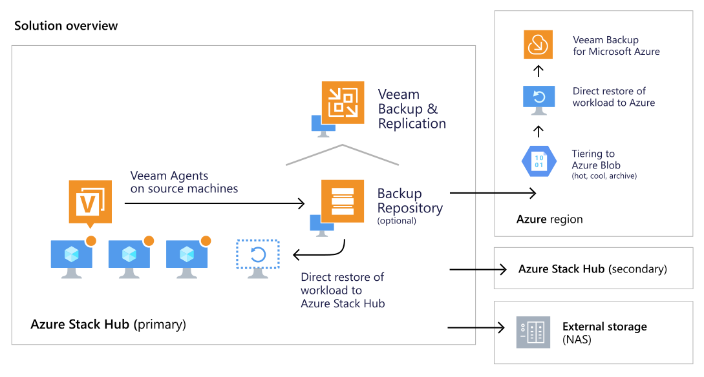
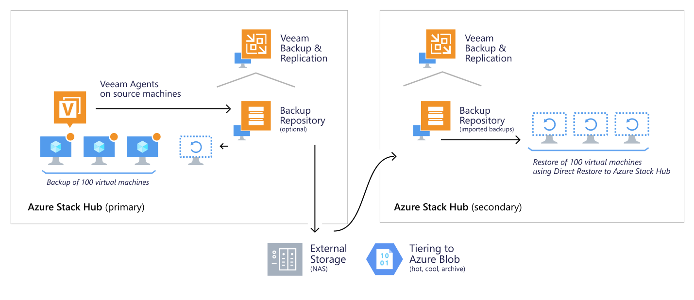

# Veeam Backup and Replication

Veeam Backup & Replication is a comprehensive data protection and disaster recovery solution. Providing a simple, flexible & reliable solution to protect your virtual, physical and cloud workloads, unstructured file data, enterprise apps and more. 

You can backup and restore workloads running on Azure Stack Hub using Veeam Agent for Windows and Veeam Agent for Linux. These can be [centrally managed](https://helpcenter.veeam.com/docs/backup/agents/quickstart.html) with Veeam Backup & Replication. Restore operations are performed using [Direct Restore to Microsoft Azure Stack](https://helpcenter.veeam.com/docs/backup/vsphere/restore_azure_process.html). By providing a centralized console for administering backup, restore and replication, Veeam allows you to automate and schedule routine data protection operations and integrate with solutions for alerting and generating compliance reports.

## Documentation

Veeam Documentation:

 - [Veeam Support for Azure Stack Hub](https://www.veeam.com/kb3244)
 - Veeam's documentation provides information about deploying, configuring, and using Veeam Backup & Replication with Azure Stack Hub.

Veeam sizing

 - Veeam Backup & Replication is sized by total capacity and throughput requirements for a customer's Azure Stack Hub environment.

Contact

 - For more information contact [Veeam Support](https://www.veeam.com/support.html).

## Test scenarios

| Scenario                    | Azure Stack Hub Version (each stamp) | Veeam version |
|-----------------------------|---------------------------------|---------------|
| AzStackHub to AzStackHub    | 1.2102.11.40                    | 11.0.0.837    |
| Migrate between AzStackHubs | 1.2102.11.40                    | 11.0.0.837    |
| Migrate to AzStackHub       | 1.2102.11.40                    | 11.0.0.837    |

## Veeam Support for Azure Stack Hub

Veeam support for Azure Stack Hub allows you to back up workloads using Veeam Agents for Windows and Linux, centrally manged by Veeam Backup & Replication. Agent-based backup allows for additional application-consistency features, and with Veeam Backup & Replication there is native agent-less restore available, direct to Azure Stack Hub. You can tier backup data from a repository on Azure Stack Hub for example, to external storage, or send it there directly. Then as a secondary tier you can use Azure Blob with hot, cool and archive tier support, with the ability to directly restore workloads in Azure as Azure VMs. Veeam offers cross-platform support, meaning you can restore dissimilar workloads from external sources, such as virtual workloads, including VMware, Hyper-V, AHV, as well as physical and cloud-based workloads to Azure Stack Hub.

## Test environment

1.  Veeam Backup & Replication v11 with latest cumulative patch
    1.  Machine type: Standard F32s_v2
    2.  Machine resources: 32 vcpus, 64 GiB memory
2.  Windows machine as Veeam Backup Repository
    1.  Machine type: Standard F64s_v2
    2.  Machine resources: 64 vcpus, 128 GiB memory
    3.  Backup volume was created as spanned volume from 4 1023 GB Premium SSD disks

> [!Note]
> Similar machines for Veeam Backup & Replication and the Backup Repository were deployed at both stamps

1.  Arbitrary storage -- Synology NAS
    1.  Added as SMB repository to Veeam Backup & Replication server
    2.  Veeam Backup & Replication acts as a gateway server
2.  Source machines
 - 100 Standard_A1_v2 (no data disks)
 - 100 Standard_F4s (no data disks)
 - 20 x Standard_F2s_v2 with 3 x 500GB data disks (were excluded from the test due to lack of available remaining RAM)
 - 20 x Standard_D3_v2 with 3 x 500GB data disks
 - 5 x Standard\_DS5_v2 with 4 x 500GB data disks
 - 5x Standard\_DS14_v2 with 20x 500GB data disks

## The setup

###  Repository:

1.  For this test the repository was set to [25 tasks for parallel processing](https://helpcenter.veeam.com/docs/backup/vsphere/repository_repository.html?ver=110)
    1.  Task = machine disk
    2.  Task slots affect both backup and restore. If no slots available -- job waits for the resource availably and only then starts to process new machine
2.  For several tests we raise the amount of task slots to 50
3.  To back up from one Stamp to another agents require direct connection to the repository, we've used backup to SMB instead of backup to repository at the stamp B

###  Discovery and deployment:

1.  VMs discovery was performed via [Agent Management functionality \> Protection groups](https://helpcenter.veeam.com/docs/backup/agents/protection_group_tasks.html?ver=110)
    1.  [Protection group was formed based on a csv](https://helpcenter.veeam.com/docs/backup/agents/protection_group_csv.html?ver=110) file with host names
    2.  Linux and Windows were separated into two dedicated protection groups for the ease of management
    3.  [CBT driver was not installed](https://helpcenter.veeam.com/docs/backup/agents/protection_group_options.html?ver=110)
    4.  [Agent throttling was disabled](https://helpcenter.veeam.com/docs/backup/agents/protection_group_advanced_vaw.html?ver=110)

### Backup jobs:

1.  Agent backup [jobs were configured as managed by backup server type](https://helpcenter.veeam.com/docs/backup/agents/agent_job_create.html?ver=110) with all the settings set to default values
    1.  Jobs were organized based on the workload type: Windows & Linux
    2.  Jobs were organized based on machine type (i.e. all machines of the same type were added to single job for the ease of management)
    3.  Some jobs were created to process single machine for benchmarking comparison

### Recovery:

1.  Recovery was performed via [Direct Restore to Azure](https://helpcenter.veeam.com/docs/backup/vsphere/restore_azure.html?ver=110) functionality
    1.  We used mostly default settings and same machine type as the source one
    2.  Stamp 1: Windows repository was the restore source
    3.  Stamp 2: Arbitrary SMB repository was the restore source
    4.  To restore from arbitrary SMB repository [backups can be imported to a new / another Veeam Backup & Replication server](https://helpcenter.veeam.com/docs/backup/vsphere/importing_backups.html?ver=110)

## Issues and workarounds:

A few configuration changes are needed for Azure Stack Hub. For an up-to-date list visit [KB3244: Veeam Support for Azure Stack Hub](https://www.veeam.com/kb3244).

Backup jobs may report warnings whenever an EFI volume was not detected due to partition layout differences with Linux images in Azure. You can safely ignore this and this may be addressed in future versions of the product.

## Tests

> [!Note]  
> Processing rates are a function of the scale of the environment, the throughput capacity and the number of parallel jobs that can be processed simultaneously. Veeam works efficiently in environments of a much larger scale, with some incredibly high throughput numbers and so these numbers below are more a reflection of the current environments state than anything else. These results only highlight what was possible with this specific environment during the time of testing. 

### Same Azure Stack Hub Stamp, within one subscription

### Backup - Single machines

| Machine name | Size    | Full backup time | Processing rate | Restore point size | Incremental backup time | Processing rate | Restore point size |
|--------------|---------|------------------|-----------------|--------------------|-------------------------|-----------------|--------------------|
| A1V2         | 40 GB   | 11m 01s          | 30MB/s          | 8.54GB             | 4m 37s                  | 60MB/s          | 116MB              |
| F4S          | 46 GB   | 6m 31s           | 19MB/s          | 1.11GB             | 2m 30s                  | 5MB/s           | 29.5MB             |
| D3V2         | 346 GB  | 20m 52s          | 30 MB/s         | 18.4GB             | 4m 49s                  | 46MB/s          | 712MB              |
| DS14v2       | 370 GB  | 10m 35s          | 72 MB/s         | 18.6 GB            | 2m 34s                  | 111 MB/s        | 538MB              |
| DS5v2        | 258 GB  | 8m 37s           | 83MB/s          | 16 GB              | 2m 33s                  | 92 MB/s         | 200MB              |

> [!Note] For testing machine type F2SV2 under a heavy load with running scripts were excluded. This script occupies all available RAM which prevents the agent process from starting. Recommendation: Plan the backup window when the application is not consuming all resources or pre-allocate at least 2GB of RAM just for the agent. 

#### Restore - Single machines

| Machine name | Processing rate | Restore time |
|--------------|-----------------|--------------|
| A1V2         | 344 MB/s        | 8 mins       |
| F4S          | 2 GB/s          | 15 mins      |
| D3V2         | 696 MB/s        | 14 mins      |
| DS14v2       | 745 MB/s        | 15 mins      |
| DS5v2        | 525 MB/s        | 14 mins      |

#### Backup -- multiple machines

| Job type              | Size    | Full backup time | Full backup time average per machine | Processing rate | Restore point size | Incremental backup time | Incremental time average per machine | Processing rate | Restore point size |
|-----------------------|---------|------------------|--------------------------------------|-----------------|--------------------|-------------------------|--------------------------------------|-----------------|--------------------|
| 5 VMs - DS5v2 - Win   | 1290GB  | 14m 41s          | 14m                                  | 223 MB/s        | 91.3GB             |                         |                                      |                 |                    |
| 5 VMs - DS14v2 - Win  | 1850GB  | 14m 57s          | 14m                                  | 224 MB/s        | 93.7GB             | 4m 53s                  | 3m                                   | 514 MB/s        | 5.2GB              |
| 20 VMs - D3V2 - Win   | 6920GB  | 49m 22s          | 44m                                  | 218 MB/s        | 377GB              | 7m 3s                   | 5m 30s                               | 438 MB/s        | 21GB               |
| 100 VMs - A1V2 - Win  | 4000 GB | 1h 53m           | 34m                                  | 218 MB/s        | 860GB              | 19m 40s                 | 4m                                   | 348 MB/s        | 23GB               |
| 100 VMs - F4S - Lin   | 460 GB  | 1h 30m           | 6m 30s                               | 87 MB/s         | 107 GB             | 13m 12s                 | 2m 10s                               | 14 MB/s         | 2GB                |

 - We've repeated the test for 100 Windows machines with repository set to 50 tasks and result was the same without any performance increase. We suspect that network becomes the bottleneck (as network consumption at the repository side never crosses 15GBs in our tests)
 - The only benefit was for Linux hosts since they have a smaller footprint and less disks thus can be processed faster

| 100 VMs - A1V2 - Win  | 4000 GB | 1h 53m  | 34m    | 218 MB/s | 860GB  | 19m 40s | 4m     | 348 MB/s | 23GB |
|-----------------------|---------|---------|--------|----------|--------|---------|--------|----------|------|
| 100 VMs - F4S - Lin   | 460 GB  | 28m 30s | 6m 30s | 300 MB/s | 107 GB | 13m 12s | 2m 10s | 14 MB/s  | 2GB  |

#### Restore -- multiple machines

| Machine name          | Processing per machine | Restore time overall | Restore time per machine |
|-----------------------|------------------------|----------------------|--------------------------|
| 5 VMs - DS5v2 - Win   | 527MB/s                | 38 m                 | 14 m                     |
| 5 VMs - DS14v2 - Win  | 1 GB/s                 | 39m                  | 16m                      |
| 20 VMs - D3V2 - Win   | 217 MB/s               | 1h 34m               | 27m                      |
| 100 VMs - A1V2 - Win  | 34 MB/s                | 2h 28m               | 44m                      |
| 100 VMs - F4S - Lin   | 1 GB/s                 | 1h 40m               | 13 mins                  |

### Same Azure Stack Hub Stamp, different subscriptions

 - We ran only a few backup and restore tests to see if there was any difference from previous tests - metrics were pretty much the same
 - In terms of benchmarking please consider that test results from the same subscription or multiple subscriptions within one stamp would be identical

#### Backup -- single machine

| Machine name | Size    | Full backup time | Processing rate |
|--------------|---------|------------------|-----------------|
| A1V2         | 40 GB   | 10m 44s          | 34MB/s          |
| F4S          | 46 GB   | 6m 31s           | 19MB/s          |
| D3V2         | 346 GB  | 20m 46s          | 32 MB/s         |
| DS14v2       | 370 GB  | 10m 44s          | 71 MB/s         |
| DS5v2        | 258 GB  | 10m 40s          | 72MB/s          |

#### Backup -- multiple machines

| Job type              | Size    | Full backup time | Full backup time average per machine | Processing rate |
|-----------------------|---------|------------------|--------------------------------------|-----------------|
| 5 VMs - DS5v2 - Win   | 1290GB  | 10m 41s          | 14m                                  | 213 MB/s        |
| 5 VMs - DS14v2 - Win  | 1850GB  | 14m 57s          | 14m                                  | 224 MB/s        |
| 20 VMs - D3V2 - Win   | 6920GB  | 49m 22s          | 44m                                  | 218 MB/s        |
| 100 VMs - A1V2 - Win  | 4000 GB | 1h 55m           | 25m                                  | 219 MB/s        |
| 100 VMs - F4S - Lin   | 460 GB  | 1h 35m           | 6m 10s                               | 88 MB/s         |

### From Azure Stack Hub Stamp 1 to SMB storage, restore to Azure Stack Hub Stamp 2 from SMB storage
You can use Veeam Backup & Replication to restore and or migrate data from one Azure Stack Hub stamp to another.

 
 - Throughput numbers highlight what was possible with this specific environment during the time of testing.
 - Agents require direct connection with repository, so for this scenario we've used an arbitrary SMB storage repository as a target for backup and restore
 - Possible scenarios to test in the future: VPN from stamp 1 to stamp 2
 - For such setup Veeam Backup & Replication in Stamp 1 acted as a gateway server for SMB share
 - Only two cases (single machine & 100 x machines backup/restore) were tested due to lack of time

#### Backup - Single machine

| Machine name | Size  | Full backup time | Processing rate | Restore point size |
|--------------|-------|------------------|-----------------|--------------------|
| A1V2         | 40 GB | 10m 48s          | 30MB/s          | 7.73GB             |

#### Restore -- multiple machines

| Machine name | Processing per machine | Restore time overall |
|--------------|------------------------|----------------------|
| A1V2         | 140 MB/s               | 10m                  |

#### Backup -- multiple machines

| Job type             | Size   | Full backup time | Full backup time average per machine | Processing rate | Restore point size |
|----------------------|--------|------------------|--------------------------------------|-----------------|--------------------|
| 100 VMs - A1V2 - Win | 1290GB | 52m 31s          | 10m                                  | 444 MB/s        | 759GB              |

#### Restore -- multiple machines

| Machine name         | Processing per machine | Restore time overall | Restore time per machine |
|----------------------|------------------------|----------------------|--------------------------|
| 100 VMs - A1V2 - Win | 132 MB/s               | 2h 6m                | 9m                       |
