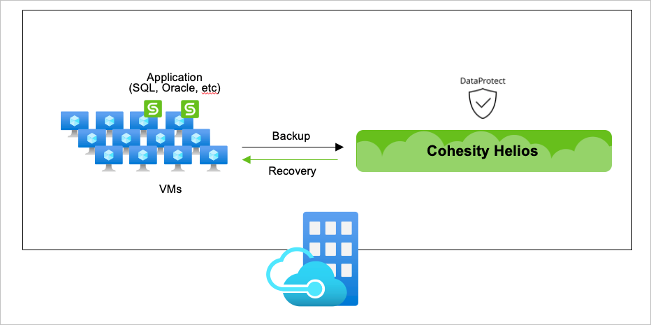
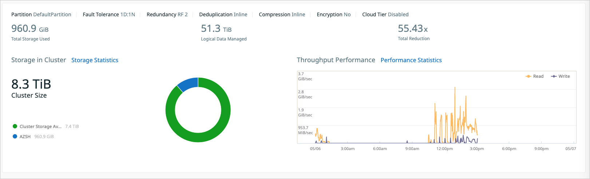

# Cohesity Data Protect

Cohesity DataProtect is a high-performance, software-defined backup and recovery solution designed for the cloud era. Designed for hyperscale, it offers the most comprehensive policy-based protection for both traditional and modern data sources.

DataProtect converges multiple-point products into a single software that can be deployed as on-premises or consumed as a service.

# Documentation

Cohesity Documentation: 

 - [https://docs.cohesity.com](https://docs.cohesity.com)
 - Cohesity's documentation provides information about deploying, configuring and using Cohesity Helios with Azure Stack Hub.

Cohesity sizing

 - Cohesity Helios is sized by total capacity and throughput requirements for a customer's Azure Stack Hub environment.

Contact

 - For more information contact Cohesity: `contact@cohesity.com`

# Test scenarios

| Scenario                    | Azure Stack Hub Version (each stamp) | Cohesity version                 |
|-----------------------------|---------------------------------|----------------------------------|
| AzStackHub to AzStackHub    | 1.2102.11.40                    | 6.6.0a_release-20210315_a47862d5 |
| Migrate between AzStackHubs | 1.2102.11.40                    | 6.6.0a_release-20210315_a47862d5 |
| Migrate to AzStackHub       | 1.2102.11.40                    | 6.6.0a_release-20210315_a47862d5 |

# Cohesity Cluster Configuration

Overview: For the test use cases, we deployed a 4-node Cohesity cluster on FRA0201 Azure Stack Hub. A Cohesity cluster can also be deployed on physical servers, as a virtual machine, in public clouds like Azure and on Azure Stack Hub to backup and recover Azure Stack Hub workloads.

**Cohesity Cluster information**

Figure 1-1 -- Overview of Cohesity cluster configuration

**Cohesity cluster configuration**

| Cohesity cluster name  | Cohesity Version                  | No. of nodes | Azure Stack Hub Internal node IP Address | Deployment model                                       |
|------------------------|-----------------------------------|--------------|------------------------------------------|--------------------------------------------------------|
| cohesity-azsh-fra0201  | 6.6.0a_release-20210315_a47862d5  | 4            | 10.0.0.6, 10.0.0.7, 10.0.0.8, 10.0.0.9   | Primary Cluster deployed on Azure Stack FRA0201        |
| cohesity-azsh-fra0202  | 6.6.0a_release-20210315_a47862d5  | 1            | 10.1.0.4                                 | Secondary test cluster deployed on Azure Stack FRA0202 |

**Node Configuration**

| Node name               | VM Size                                   | Disks                                                                | IP Address |
|-------------------------|-------------------------------------------|----------------------------------------------------------------------|------------|
| cohesity-azsh-fra0201-1 | Standard DS5 v2 (16 vcpus, 56 GiB memory) | 1 x 512 GB Premium SSD (Metadisk) 2 x 1023 GB Premium SSD (DataDisk) | 10.0.0.8   |
| cohesity-azsh-fra0201-2 |                                           |                                                                      | 10.0.0.6   |
| cohesity-azsh-fra0201-3 |                                           |                                                                      | 10.0.0.7   |
| cohesity-azsh-fra0201-4 |                                           |                                                                      | 10.0.0.9   |
| cohesity-azsh-fra0202-2 |                                           |                                                                      | 10.1.0.4   |

Figure 1-2 -- Cohesity cluster node configuration for cohesity-azsh-fra0201

Figure 1-3 -- Cohesity cluster storage domain for cohesity-azsh-fra0201

Figure 1-4 -- Cohesity cluster node configuration for cohesity-azsh-fra0202

Figure 1-5 -- Cohesity cluster storage domain for cohesity-azsh-fra0202

## Section 2: Use Case: AzStackHub VM Backup and Recovery

Overview: Backup and recover Azure Stack Hub VM from Cohesity cluster deployed on Azure Stack Hub

Figure 2-1 -- Overview of Cohesity cluster configuration on Azure Stack Hub

Figure 2-2 -- Registered Azure Stack Hub Source Subscriptions for backup and recovery

# Backup Tests

**Test case 1:** Use multiple Protection Groups to backup Azure Stack Hub VMs and run protection jobs scheduled 30 minutes apart

**Test case 1 Protection Groups:**

| **Cohesity Protection Group Name** | **No. of VMs per Protection Group** | **Sample Backup Times** |
|------------------------------------|-------------------------------------|-------------------------|
| LIN-HLF4S-0-24                     | 25                                  | 5:30:00 PM              |
| LIN-HLF4S-25-49                    | 25                                  | 6:00:00 PM              |
| LIN-HLF4S-50-74                    | 25                                  | 6:30:00 PM              |
| LIN-HLF4S-75-99                    | 25                                  | 7:00:00 PM              |
| WIN-HLA1V2-0-24                    | 25                                  | 7:30:00 PM              |
| WIN-HLA1V2-25-49                   | 25                                  | 8:00:00 PM              |
| WIN-HLA1V2-50-74                   | 25                                  | 8:30:00 PM              |
| WIN-HLA1V2-75-99                   | 25                                  | 9:00:00 PM              |
| WIN-HLD3V2-0-19                    | 20                                  | 9:30:00 PM              |
| WIN-HLDS14v2-0-4                   | 5                                   | 10:00:00 PM             |
| WIN-HLDS5v2-0-4                    | 5                                   | 10:30:00 PM             |
| WIN-HLF2SV2-0-19                   | 20                                  | 11:00:00 PM             |

**Test case 1 Protection Policy:**

**Policy Name:** AZSH VM

Figure 2-4 -- Test case 1 Protection Policy

**Test case 1 additional Cohesity configuration:**

**Test case 1** AZSH

Figure 2-5 -- Test case 1 storage domain

**Test case 1 results:**

| **Protection Group** | **Backup Type** | **Backup Duration** | **Backup Type** | **Backup Duration** | **Backup Type** | **Backup Duration** | **Backup Type** | **Backup Duration** |
|----------------------|-----------------|---------------------|-----------------|---------------------|-----------------|---------------------|-----------------|---------------------|
| WIN-HLF2SV2-0-19     | Full            | 1h34m51             | Incremental     | 49m25               | Incremental     | 46m31               | Incremental     | 50m31               |
| WIN-HLDS5v2-0-4      | Full            | 15m10               | Incremental     | 15m1                | Incremental     | 9m2                 | Incremental     | 14m19               |
| WIN-HLDS14v2-0-4     | Full            | 6m20                | Incremental     | 20m55               | Incremental     | 6m35                | Incremental     | 5m55                |
| WIN-HLD3V2-0-19      | Full            | 25m35               | Incremental     | 31m41               | Incremental     | 37m51               | Incremental     | 25m39               |
| WIN-HLA1V2-75-99     | Full            | 16m9                | Incremental     | 58m53               | Incremental     | 23m37               | Incremental     | 19m27               |
| WIN-HLA1V2-50-74     | Full            | 16m30               | Incremental     | 31m52               | Incremental     | 19m27               | Incremental     | 20m47               |
| WIN-HLA1V2-25-49     | Full            | 9m59                | Incremental     | 45m12               | Incremental     | 20m12               | Incremental     | 20m5                |
| WIN-HLA1V2-0-24      | Full            | 22m50               | Incremental     | 48m58               | Incremental     | 13m2                | Incremental     | 20m16               |
| LIN-HLF4S-75-99      | Full            | 4m0                 | Incremental     | 4m37                | Incremental     | 16m36               | Incremental     | 10m40               |
| LIN-HLF4S-50-74      | Full            | 9m26                | Incremental     | 4m55                | Incremental     | 4m30                | Incremental     | 11m0                |
| LIN-HLF4S-25-49      | Full            | 9m28                | Incremental     | 4m38                | Incremental     | 11m29               | Incremental     | 4m57                |
| LIN-HLF4S-0-24       | Full            | 3m21                | Incremental     | 4m24                | Incremental     | 15m7                | Incremental     | 10m45               |

**Test case 2:** Use a single protection group to backup all 250 VMS

**Test case 2 Protection Group:** ALL Heavyload RG

Figure 2-6 -- Test case 2 Protection Group

**Test case 2 Protection Policy Overview**

**Policy Name:** AZSH ALL VM Backup Policy

Figure 2-7 -- Test case 2 Protection Policy

**Test case 2 additional Cohesity configuration:**

Cohesity Storage Domain: AZSH-ALL

Figure 2-8 -- Test case 2 Storage Domain

**Test case 2 results**

| **Protection Group** | **Backup Type** | **Backup Duration** |
|----------------------|-----------------|---------------------|
| ALL Heavyload RG     | Full            | 2h17m30             |
| ALL Heavyload RG     | Incremental     | 2h40m3              |
| ALL Heavyload RG     | Incremental     | 2h5m0               |

### Recovery Tests

Azure Stack Hub VMs were recovered groups by VM size

| Recovery Groups  | Recovery Duration |
|------------------|-------------------|
| LIN-HLF4S-0-99   | 2h 39m 53s        |
| WIN-HLA1V2-0-99  | 1h 0m 20s         |
| WIN-HLD3V2-0-19  | 1h 25m 33s        |
| WIN-HLDS14v2-0-4 | 1h 49m 50s        |
| WIN-HLDS5v2-0-4  | 1h 51m 11s        |
| WIN-HLF2SV2-0-19 | 2h 15m 22s        |

## Migrate between AzStackHubs

 - Tests moving the VMs from one AzStackHub to another AzStackHub
 - Tested scenarios (all data disks should be filled with data/ half Windows and half Linux)
     - Basic
         - One Standard_A1_v2 with 2 x 500GB data disks
         - One Standard_F4s with 2x 500GB data disks -- unmanaged disks
         - One Standard_F4s with 2x 500GB data disks with an extension
         - One Standard_DS14_v2 with with 2x 500GB data disks
     - Medium load
         - 50 Standard_A1_v2 (no data disks)
         - 50 x Standard_F2s_v2 with 1 x 500GB data disks
         - 15 x Standard_D3_v2 with 3 x 500GB data disks
         - 5 x Standard\_DS5_v2 with 3 x 500GB data disks
     - Heavy load
         - 100 Standard_A1_v2 (no data disks)
         - 100 Standard_F4s (no data disks)
         - 20 x Standard_F2s_v2 with 3 x 500GB data disks
         - 20 x Standard_D3_v2 with 3 x 500GB data disks
         - 5 x Standard\_DS5_v2 with 4 x 500GB data disks
         - 5x Standard\_DS14_v2 with 20x 500GB data disks

### Backup data archived (CloudArchive) from cohesity-azsh-fra0201 to external NFS share

| Logical Data Replicated | Replication Type | Replication Duration |
|-------------------------|------------------|----------------------|
| 13 TiB                  | Full             | 4h 16m 56s           |
|                         | Full             | 3h 34m 32s           |

### Recovery Tests

Azure Stack Hub VMs were recovered from Cohesity cluster deployed on FRA0201 to FRA0201

| Recovery Groups  | Recovery Duration |
|------------------|-------------------|
| LIN-HLF4S-0-99   | 4h 38m 27s        |
| WIN-HLA1V2-0-99  | 1h 26m 22s        |
| WIN-HLD3V2-0-19  | 2h 14m 47s        |
| WIN-HLDS14v2-0-4 | 2h 47m 39s        |
| WIN-HLDS5v2-0-4  | 3h 11m 24s        |
| WIN-HLF2SV2-0-19 | 3h 58m 38s        |

## AzStackHub to AzStackHub

 - Test protection of VMs from one AzStackHub to another AzStackHub
 - Tested scenarios (all data disks should be filled with data / half Windows and half Linux)
     - Basic
         - One Standard_A1_v2 with 2 x 500GB data disks
         - One Standard_F4s with 2x 500GB data disks -- unmanaged disks
         - One Standard_F4s with 2x 500GB data disks with an extension
         - One Standard_DS14_v2 with with 2x 500GB data disks
     - Medium load
         - 50 Standard_A1_v2 (no data disks)
         - 50 x Standard_F2s_v2 with 1 x 500GB data disks
         - 15 x Standard_D3_v2 with 3 x 500GB data disks
         - 5 x Standard\_DS5_v2 with 3 x 500GB data disks
     - Heavy load
         - 100 Standard_A1_v2 (no data disks)
         - 100 Standard_F4s (no data disks)
         - 20 x Standard_F2s_v2 with 3 x 500GB data disks
         - 20 x Standard_D3_v2 with 3 x 500GB data disks
         - 5 x Standard\_DS5_v2 with 4 x 500GB data disks
         - 5x Standard\_DS14_v2 with 20x 500GB data disks

### Replication from cohesity-azsh-fra0201 to cohesity-azsh-fra0202

| **Protection Group** | **Replication Duration** |
|----------------------|--------------------------|
| WIN-HLF2SV2-0-19     | 4h 34m 44s               |
| WIN-HLDS5v2-0-4      |  1h 50m 51s              |
| WIN-HLDS14v2-0-4     | 2h 24s                   |
| WIN-HLD3V2-0-19      | 1h 57m 33s               |
| WIN-HLA1V2-75-99     | 1h 17m                   |
| WIN-HLA1V2-50-74     | 1h 5m 47s                |
| WIN-HLA1V2-25-49     | 1h 5m 56s                |
| WIN-HLA1V2-0-24      | 1h 2m 22s                |
| LIN-HLF4S-75-99      | 15m 33s                  |
| LIN-HLF4S-50-74      | 14m 15s                  |
| LIN-HLF4S-25-49      | 14m 25s                  |
| LIN-HLF4S-0-24       | 13m 58s                  |

### Recovery Tests from single node Cohesity cluster deployed on FRA0202 with replicated data from FRA0201

Azure Stack Hub VMs recovery times from single node Cohesity cluster on FRA0202

| Recovery Groups  | Recovery Duration |
|------------------|-------------------|
| LIN-HLF4S-0-99   | 2h 22m 12s        |
| WIN-HLA1V2-0-99  | 2h 29 m 55s       |
| WIN-HLD3V2-0-19  | 1h 41m 0s         |
| WIN-HLDS14v2-0-4 | 1h 55m 35s        |
| WIN-HLDS5v2-0-4  | 43m 19s           |
| WIN-HLF2SV2-0-19 | 3h 0m 9s          |
