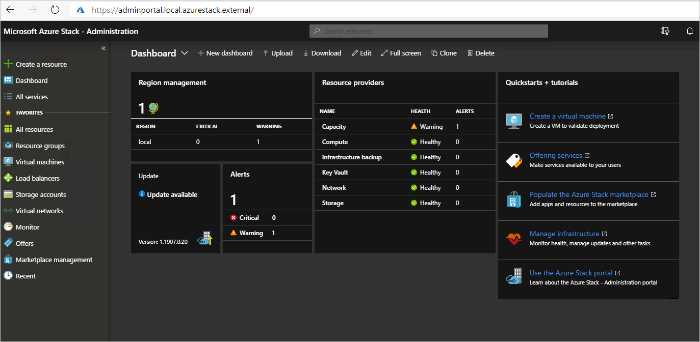
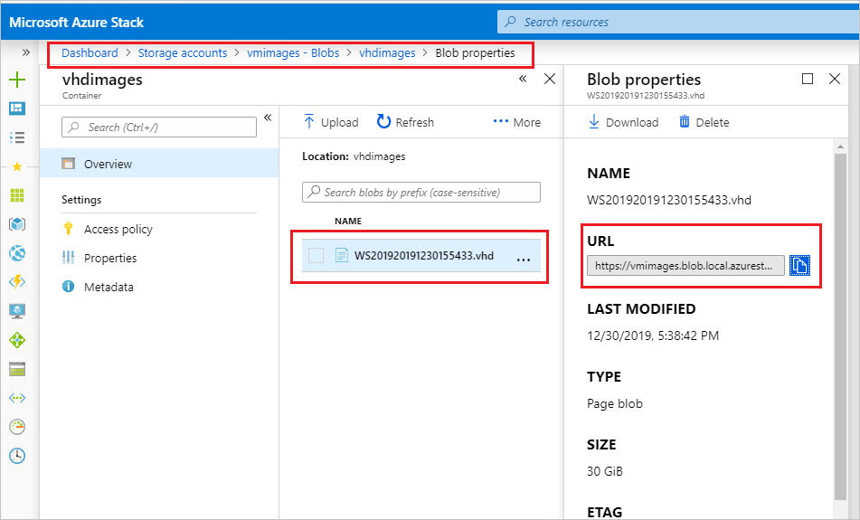
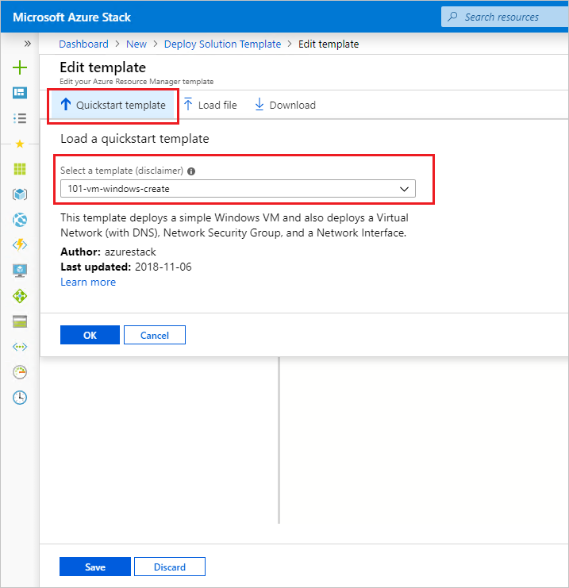
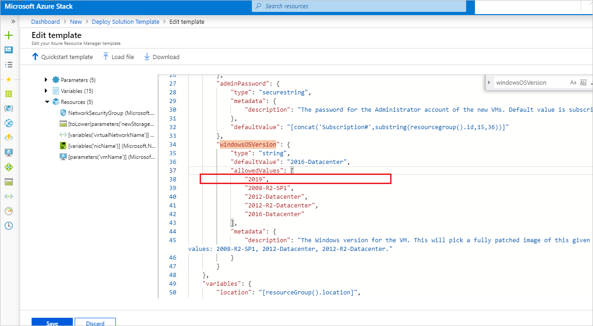

# Lab Guide Operator lab

Cloud Operator Training - Azure Stack Hub Lab
Lab Guide
Version 0.1

## Overview

This lab consists of step-by-step procedures relevant for an Azure Stack Hub Operator. The lab uses an ASDK that is meant to provide an environment in which an IT Administrators or Developers can evaluate Azure Stack Hub and develop modern apps using APIs and tooling consistent with Azure in a *non-production* environment. The assumption for this ASDK is that it is deployed as an Azure Active Directory Integrated environment, therefore all Azure Stack Hub users are hosted from Azure vs a separate on premises Active Directory Domain Services environment.

In this set of procedures, the lab user will perform functions as both the Azure Stack Hub Operator and an Azure Stack Hub User. 

## Lab Environment

There are several ways to deploy an ASDK - you can check the http://aka.ms/asdk to download and use the Microsoft recommended options, or you could try community based scripts that help create ASDKs that are hosted even in Azure (https://github.com/yagmurs/AzureStack-VM-PoC).

Regardless how you deploy it, this guide assumes that:
1. you have a running ASDK, that leverages AAD for identity
2. the ASDK is already registered and configured (for more info on configuring it, either use the guidance found at https://docs.microsoft.com/azure-stack/asdk/asdk-install - or use the community based set of scripts called "[Azure Stack POC Configurator](https://github.com/mattmcspirit/azurestack)" )
3. PowerShell for Azure Stack Hub
4. Latest Azure Stack Hub Tools
5. Sample Virtual Machine Images from the Azure Marketplace
6. AppService Resource Provider
7. SQL Resource Provider
8. you have already connected to the ASDK environment

The guide also assumes you have access to the AzureStack\AzureStackAdmin, the AzureStack\CloudAdmin, as well as the AAD user that has Owner rights on the Default Provider Subscription of your ASDK (in most cases, this should be the same AAD-user that you used when installing the ASDK). In the following exercises, this user is named "aadUserName" and has the respective "aadUserPassword". 

# Workshop overview

The next exercises focus on the Operator experience of Azure Stack Hub. They go through:

1. Test Azure Stack Hub
2. Diagnostics
3. Capacity Management
4. Quotas / Plans / Offers
5. Custom Images

# Test Azure Stack

In the next steps we will:

- Configuring and connecting to the privileged endpoint (PEP)

- Test Azure Stack health

While logged on to the ASDK Virtual Machine, open the Azure Stack User Portal icon. For the next steps, use the "aadUserName" and the "aadUserPassword" from the CRED.TXT file on the desktop.

1.  Open Hyper-V Manager and click on the **AzS-ERCS01** VM

2.  Select the **Networking** tab and note down the IP address of the **AzS-ERCS01** VM

  

  > the \#1 and \#2 steps above can only be done in the ASDK. In actual deployments, the info for the PEP ca be found in the Admin Portal, in the Region Management -&gt; Properties blade.

  Here you can also see the Azure subscription used to register your Azure Stack Hub as well as other important information about the Azure Stack Hub.

  

3.  Open **Windows PowerShell ISE** in an administrative window

4.  To establish trust run
```
  winrm s winrm/config/client '@{TrustedHosts="&lt;IP Address of Privileged Endpoint&gt;"}'
```
  > this step isn’t needed on the ASDK, we are running it as an example for the actual Azure Stack Hub environments.

  

1. To connect to **PEP** run:

```powershell
  $cred = Get-Credential

  Enter-PSSession -ComputerName azs-ercs01 -ConfigurationName PrivilegedEndpoint -Credential $cred
```

  > use **azurestack\\cloudadmin** as the user with the respective password

  Run "**get-command**" to list all the commands available

  

1. The following example runs **Test-AzureStack** to test system readiness before installing an update or hotfix using **Group**. Before you start the installation of an update or hotfix, run **Test-AzureStack** to check the status of your Azure Stack

```powershell
  Test-AzureStack -Group UpdateReadiness
```


# Diagnostics

## Collecting logs – "rainy day" scenario

Collecting logs requires a connection to the PEP and a shared location where the logs would be uploaded. This location could either be an SMB share, or a Storage Account. In the exercise below we will use a storage account from Azure Stack Hub

1. Open the **Azure Stack User Portal** link and login using the **aadUserName** user

2. Select the **Storage Account** created in the User-exercises earlier, or create a new **Storage Account**

3. Click on the "**Shared access signature**" tab and generate SAS and connection string

4. Copy the SAS token

  

5.  Go back to the **Overview** tab of this storage account, click on **Blobs**, and create a new **Container**

  

6.  Click on the new **container**, select properties and **copy the URL**

  

7.  Connect to PEP (same procedure as exercise \#3 if you have closed it) and run

```powershell
  Get-AzureStackLog -OutputSasUri "<Blob service SAS Uri>"
```

  > the "&lt;Blob service SAS Uri&gt;" is created by the container URL you have copied from above + the SAS key (note in the picture how before the "?" is the URL and the "?" starts the SAS token)

  

8.  Wait for logs to be collected – this can take a few minutes

Links:

Collect Azure Stack diagnostic logs on demand - <https://docs.microsoft.com/en-us/azure-stack/operator/azure-stack-configure-on-demand-diagnostic-log-collection>

Configure automatic Azure Stack diagnostic log collection - <https://docs.microsoft.com/azure-stack/operator/azure-stack-configure-automatic-diagnostic-log-collection>

## Analyzing logs

Make sure the log collection (step 4.1) finished successfully and the logs are created in the respective storage account. In the next steps we will look at the logs and what type of information is provided – as this is ran in the ASDK, the results themselves aren’t relevant, but we ran this to gain familiarity with the operation.

1.  On the ASDK, download AzCopy

  <https://docs.microsoft.com/en-us/azure/storage/common/storage-use-azcopy-v10>

  unzip the file to access azcopy.exe

2.  To configure the API version for AzCopy to support Azure Stack, set the AZCOPY\_DEFAULT\_SERVICE\_API\_VERSION environment variable to 2017-11-09

  In the PowerShell session, run:

```powershell
  $env:AZCOPY_DEFAULT_SERVICE_API_VERSION="2017-11-09"
```

  

3.  Create a folder on C: for your logs (in this example it’s "c:\\collectedlogs")

4.  To copy the collected logs, use

```powershell
.\azcopy.exe cp "<Blob service SAS Uri>" "local destination path" --recursive=true
```

  Where the "&lt;Blob service SAS Uri&gt;" is the same one used above in exercise \#4.1

  

5.  When the copy is complete, open Windows Explorer and browse to the logs

6.  Find a file names "SeedRing-### \#.zip" and extract the contents of "**AzS-ERCS01**"

  

7.  Open the **Summary** for a list of the collected information

  

8.  These are the same results as seen when you ran "**test-azurestack**" – but more information will be provided

  

9.  Depending on the findings, on an Azure Stack Hub integrated system you would decide what the next steps are and if Microsoft Support needs to be involved.


Links:

Use data transfer tools in Azure Stack Storage - <https://docs.microsoft.com/en-us/azure-stack/user/azure-stack-storage-transfer>

# Capacity Management and Usage Reporting

Using quotas, plans, and offers, the Operator is building a capacity management practice by balancing what is available to the users, while in the same time needs to ensure enough capacity is present for future workloads. In the next exercise we will:

- Gain experience with creating quotas, plans, offers

- Using the usage database to pull information regarding used capacity

- Using the Capacity blade

# Create quotas / plans / offers

1.  Open the **Azure Stack Admin Portal** link  and login using the **aadUserName** user

  

2.  In the **Azure Stack -- Administration** portal, select **All Services** and select **Plans** from **Administrative Resources**.

  

  > [!Note] the "Search bar" on the middle of the Administration portal is your key to finding shortcuts to almost anything in the portal

3.  In the **Plans** blade, select the **Add** button and in the **New Plan** blade, set the following values and select **Create**:

  a. Display name: **Plan 1**
  
  b. Resource name: **new-plan-1**
  
  c. Resource Group: Select the **Create new** radio button and in the textbox below, specify **Offer1RG** as the name of the new resource group.
  
  d. Services: In the Services blade, select **Microsoft.Compute**, **Microsoft.Network,** **Microsoft.Storage** and **Microsoft.Web**
  
  e. Quotas: In the **Quotas** blade, select each of the services outlined above and select their **Default Quota**.
  
  > Click "**Create New**" to explore each of the quotas and options available

4.  Click "**Create**" when ready to create the Plan

  

5.  Click on the **Offers** and create a new **Offer**

  a.  Call this **Offer\_1** and select the RG created previously (in this example **Offer1RG**)

  b.  Do not make the offer public

  c.  Use the **Plan1** created previously and no add-on plans

  d.  Create the offer

  

6.  Open the **Azure Stack User Portal** link  and login using the **aadUserName** user (if it was already open, refresh the portal)

7.  Either click on "**Get a subscription**" from the dashboard, or click on **All Services**, select **Subscriptions** and click on Add

  > notice how the offer created isn’t available

  

8.  Open the **Azure Stack Admin Portal**, go to the **offers**, find the offer just created (in this example it’s called **Offer\_1**), select the Overview tab, click on **Change State**, and set this as a **Public** offer

  

9.  Go back on the **Azure Stack User Portal** and create a new subscription based on this offer

  

10.  Create a new VM (any type), with a Public IP, in the newly created subscription


## The Capacity blade

Open the **Azure Stack Admin Portal** link and login using the **aadUserName** user. Browse to the Region Management blade and open the Capacity tab.


Notice the available information on the capacity available in the ASDK and how only Public IP pools can be added.

## Usage reporting

1. On the ASDK, open Windows PowerShell ISE and configure the environment to target the **Azure Stack admin management endpoint**:

```powershell
 # Register an Azure Resource Manager environment that targets your Azure Stack instance. Get your Azure Resource Manager endpoint value from your service provider.
    Add-AzureRMEnvironment -Name "AzureStackAdmin" -ArmEndpoint "https://adminmanagement.local.azurestack.external" `
      -AzureKeyVaultDnsSuffix adminvault.local.azurestack.external `
      -AzureKeyVaultServiceEndpointResourceId https://adminvault.local.azurestack.external

    # Set your tenant name.
    $AuthEndpoint = (Get-AzureRmEnvironment -Name "AzureStackAdmin").ActiveDirectoryAuthority.TrimEnd('/')
    $AADTenantName = "<theNameofyouraad.onmicrosoft.com>"
    $TenantId = (invoke-restmethod "$($AuthEndpoint)/$($AADTenantName)/.well-known/openid-configuration").issuer.TrimEnd('/').Split('/')[-1]

    # After signing in to your environment, Azure Stack cmdlets
    # can be easily targeted at your Azure Stack instance.
    Add-AzureRmAccount -EnvironmentName "AzureStackAdmin" -TenantId $TenantId 
```

  > replace &lt;theNameofyouraad.onmicrosoft.com&gt; with the AAD name from the creds.txt file

1.  Login using the **aadUserName** and respective password

2.  Run "**get-azureRmContext**" to check you are connected to the Default Provider Subscription

  

4.  Run **Get-AzsSubscriberUsage** and provide the reported start time as yyyy-mm-dd (yesterday) and ReportedEndTime as yyyy-mm-dd (today)

  

  > [!Note] as you can see, this is fairly hard to understand how usage is generated and which tenant/user-subscription consumes what. To help with this, we have a powershell script (usagesummary.ps1) in the AzureStack Tools, which creates a CSV file that can easily be converted in Excel and used to generate reports and such.

5.  To use the UsageSummary, navigate to C:\\AzureStack-Tools-master\\Usage and run "usagesummary.ps1" with the same dates

6.  In the "C:\\AzureStack-Tools-master\\Usage" folder you will find a new .csv file with the aggregated usage

  > [!Note] go to <https://github.com/Azure/AzureStack-Tools/tree/master/Usage> [!Note]o explore how Usagesummary.ps1 is generated and what properties are exported
  
  

> [!Tip]  you can run the same UsageSummary report later in the week and try to identify the resources you’ve created through the exercises.

# Custom images

There are multiple ways to add an image that can be used by the Azure Stack Hub users. In the next exercises we will explore these options and the RBAC that might be needed for certain images:

- Creating images available only in a Azure Stack Hub User Subscription

- Creating images available for all users, but not present in the gallery / marketplace

- Publishing packages in the gallery / marketplace for existing images

- Removing gallery items

- Using offline syndication – for disconnected environments, or environments where internet access isn’t stable

- Using KeyVault when creating images

- Create custom RBAC roles

## VM image – user portal

For this next step, you will need an VHD which is sysprep'ed and prepared to be used as an image on Azure Stack. [There are multiple ways of creating this image](https://docs.microsoft.com/azure-stack/operator/azure-stack-add-vm-image), including using Azure VMs. If you are using Azure VMs, you can upload the syspreped VHD in a storage account and use it as below (if you are not, consider uploading the vhd on the ASDK on a storage account)

> the following steps assume you have used an Azure VM and uploaded the prepared VHD in a public storage account names "storageaccount", using a container named "vhdimages"

In the ASDK, using AzCopy in a PowerShell window, download the image - from

https://storageaccount.blob.core.windows.net/vdhimages/WS201920191230155433.vhd


> [!Note] the vhd doesn’t contain the MD5 data and if you run azcopy without the "--check-md5=NoCheck" option, it’ll fail because the hash will not match

.\\azcopy.exe copy "https://storageaccount.blob.core.windows.net/vdhimages/WS201920191230155433.vhd" "C:\\r" --check-md5=NoCheck

Create an image used in a single subscription:

1. Open the **Azure Stack User Portal** link  and login using the **aadUserName** user

2. Create a new **Storage Account** and a new **Container**

  

3. Create a new SAS token for this storage account and note it down

  > [!Note] for simplicity, leave all the permissions selected

  

4. Using AzCopy, upload the downloaded VHD into the new Container in the Storage Account

  > [!Note] make sure to run

```powershell
  $env:AZCOPY_DEFAULT_SERVICE_API_VERSION="2017-11-09"
```

  In the PowerShell window in order to enable azcopy to upload the file to AzStackHub

  

  Also make sure to add the "container" name in the SAS key created above (highlighted in the example on the right)

5. Click on **All Services**, **Images**, and create a new **Image**

  


6. Complete the required fields and select the vhd uploaded above

  


7. Once the image is created, use it to create a new VM (complete all the required fields as needed)

> [!Note] after the VM is provisioned, notice the VHD size and how the image was created.


Links:

Add a custom VM to Azure Stack - <https://docs.microsoft.com/en-us/azure-stack/operator/azure-stack-add-vm-image>

## Create image – operator

1. Open the **Azure Stack User Portal** link  and login using the **aadUserName** user

2. Click the storage account used to host the VM image copied above and select the container which includes that VHD.

3. Set the container access level to public

  > [!Note]  this is only for simplifying the exercise.

4. Click on the container and on the VHD copied – save the **URL** to the VHD

  > [!Note]  this will be used later in the exercise

  
  
  


5. Open the **Azure Stack Admin Portal** link  and login using the **aadUserName** user

6. Click on **Region Management**, select **Compute**, click on **VM Images**, and select **Add**

  

7. Complete the required fields with any values you wish and specify the OS data disk URI as the path to the VHD image copied earlier

  

8. The image will be creating which includes the copy of the VHD

  > [!Note]  this might take a few minutes – make sure the image has a "succeeded" status before creating the VM (you can continue with the next steps to create the template, just don’t start the VM creation before the VM image has a "succeeded" status)

  

9. Open the Azure Stack User Portal link  and login using the aadUserName user

10. Click on **Create a resource** and select **Template deployment**

11. Click on **Template**, select **Quickstart templates**, and select the "101-vm-windows-create" template

  

12. Edit the template to use the **Publisher**, **Offer**, and **SKU** used to create the VM image earlier in the exercise

  
  
  

13. Complete the required Parameters – make sure the **WindowsVersion** corresponds to the **SKU** value defined above

  > [!Note]  the "windowsversion" parameter is used in the template itself. This could be changed to any other name for that parameter.

  

14. After the VM is provisioned browse to the VM resource and notice the size of the Disk and how it’s configured

  > [!Note]  also notice how the VM uses a nonmanaged disk (as opposed to creating the VM from the

  > [!Tip]  use a different template (which uses a windows image) to deploy different resources, using the same image.


Links:

Add a custom VM to Azure Stack - <https://docs.microsoft.com/en-us/azure-stack/operator/azure-stack-add-vm-image>

## Create marketplace item

1. On the ASDK, download the Azure Gallery Packager tool (<https://aka.ms/azsmarketplaceitem>) and unzip the package.

2. Browse to the Custom VMs folder and create a copy of the "TestWindows.Test.1.0.0.azpkg" file

3. Once copied, change the type of this file to "zip"

4. Copy it’s contents to a new folder (in this example, the "SimpleWinVM" folder)

  

5. When you create the AZPKG, there are a number of folders created in the process – you can safely remove them.

  > [!Note]  this includes the folders with GUID-like names and the "\_rels" folders. The folders important to our exercise are: DeploymentTemplates, icons, strings, and the Manifest.jason + UIDefinition.json files.

  

  

6. Open **VSCode** and add a the working folder as the path to the "SimpleWinVM" folder

  > [!Note]  to make things simpler, copy the "SimpleWinVM" folder in a temporary folder on C: (in this example, I’m using "C:\\r")

  

7. Navigate to the **DeploymentTemplates** folder and open the **WindowsTemplate.json** file

8. Find the "**variables**" section and identify the **publisher**, **offer**, and **sku** variables

9. Replaces these with the ones used to publish the VM image above (in this example, I’m using:

  "publisher": "demopublish",

  "offer": "Server",

  "sku": "2019",

  > [!Note]  notice how the "version" variable is set to latest, this means if you have multiple versions of the same image (in our case the version is 1.0.0) it would use the latest one. This however is how you can control which image version is used.

  

10. Notice the contents of the rest of the files of the package. If you’d like, you can customize these as needed – these names will appear on the marketplace item.

11. When you are done, save all changes and close **VScode**.

  

  

  

12. Open a Powershell window and navigate to the folder you’ve extracted the **Azure Stack Marketplace Item Generator and Sample Items**

13. Run ".\\AzureGallery.exe package -m C:\\r\\SimpleWinVM\\Manifest.json -o c:\\r"

  > [!Note]  AzureGallery package \[-m &lt;path to manifest xml&gt; -o &lt;output directory&gt;\]

  

14. Open the Azure Stack User Portal link  and login using the aadUserName user

15. Navigate to the storage account created before which contains the vhd image (in this example, it’s called **vmimages**) and click on the container (in this example it’s called **vhdimages**)

  > [!Note]  it could be any storage account, we are using this one because it’s already created and made public which makes it easier to use.

16. Click on Upload and navigate to the azpkg file created above (in this example, it would be in the "c:\\r" folder) and upload the file

  

17. Once uploaded, click on it and copy the URL to the AZPKG

  

18. Open a PowerShell IDE and configure the environment to the adminmanagement endpoint

```powershell
$ArmEndpoint = "https://adminmanagement.local.azurestack.external/"
Add-AzureRMEnvironment -Name "AzureStack" -ArmEndpoint $ArmEndpoint
Add-AzureRmAccount -EnvironmentName "AzureStack"
```
  
  > [!Note]  when prompted, use the aadUserName username to login. Once logged in, run "get-azurermcontext" to validate you are connected to the Default Provider Subscription (on the Administration Portal)

  

19. Run

```powershell
  Add-AzsGalleryItem -GalleryItemUri <https://vmimages.blob.local.azurestack.external>
  /vhdimages/TestWindows.Test.1.0.1.azpkg -verbose
```

  to add the gallery package to the Marketplace.

  

19. Open the **Azure Stack User Portal** link  and login using the **aadUserName** user

20. Open the **Marketplace** (Create a resource) and type "test" to search for the newly created image

21. Add the required parameters and create the VM

22.  Examine the resources created (disk type, size of disk, etc)


> [!Tip]  Without changing the example manifest.json, the image will be created in the "Custom" category in the Marketplace. Use the manifest settings to change the category and create your own – this could be used to create department-specific images, or to highlight certain classes of images.

In this example, I’ve created a new category called "ITapprovedImages"


Links:

Create and publish a custom Azure Stack Marketplace item -<https://docs.microsoft.com/en-us/azure-stack/operator/azure-stack-create-and-publish-marketplace-item>

### Remove gallery image

When you add a gallery image (steps described in chapter 6.3 above), this image does not appear in the Marketplace Management the same way as images downloaded from the Azure Stack Marketplace do. In order to remove an image you need to:

- Connect to the admin-management-endpoint

- Run "Get-AzsGalleryItem" to retrieve a list of all the items and find the one you are looking for

  - In the example above, notice how the name is listed when you add the image

- Run "Remove-AzsGalleryItem -Name &lt;name of object&gt;" to remove it

- Run "Get-AzsGalleryItem" again to check the item has been successfully removed.

- Check the Azure Stack User Portal Marketplace that the item is removed

  - Although you won’t be able to create items immediately, it might take a few minutes for the actual item to be removed from the marketplace


## Use KeyVault when creating VM

1.  Open an PowerShell ISE and configure the context to the Azure Stack Endpoint

```powershell
$ArmEndpoint = "https://management.local.azurestack.external/"
Add-AzureRMEnvironment -Name "AzureStack" -ArmEndpoint $ArmEndpoint
Add-AzureRmAccount -EnvironmentName "AzureStack" 
```
  
  > [!Note]  when prompted, use the aadUserName username to login. Once logged in, run "get-azurermcontext" to validate you are connected to the "AzS PoC Subscription" (on the User Portal)

1. Run the following commands to create a KeyVault and create a Secret in this KeyVault:

```powershell
$vaultName = "myKeyVault"
$resourceGroup = "myKeyVault-RG"
$location = "local"
$secretName = "MySecret"

New-AzureRmResourceGroup -Name $resourceGroup -Location $location

New-AzureRmKeyVault -VaultName $vaultName -ResourceGroupName $resourceGroup -Location $location -EnabledForTemplateDeployment

$secretValue = ConvertTo-SecureString -String 'Test1234!@#$' -AsPlainText -Force


Set-AzureKeyVaultSecret -VaultName $vaultName -Name $secretName -SecretValue $secretValue
```


  

3. After the command completes, run

  Get-AzureRmKeyVault
  
  And note the ResourceID (please copy the entire line and remove any breaks, as it might cross on multiple lines)

  
  
4. Open a browser and go to Azure Stack QuickStart Templates page on GitHub – there, you will find the "101-vm-windows-create" template

5. Download or copy the contents of the two files: **azuredeploy.json** and **azuredeploy.parameters.json**

  > [!Note]  you can click on the files, go to "raw", and copy all the contents in a file on desktop. In this example, I’ve created two local files "template.json" and "template.parameters.json" which I’ll use to deploy the VM using the KeyVault secret.

  

6. Once you have the files, edit the parameters file to include the user name and the password you desire. To achieve this, you will need to include the reference to the KeyVault Secret created earlier:

  ```Json  
    {
  
    "\$schema": "https://schema.management.azure.com/schemas/2015-01-01/deploymentParameters.json\#",
  
    "contentVersion": "1.0.0.0",
  
    "parameters": {
  
    "adminUsername": {
  
    "value": "azureuser"
  
    },
  
    "adminPassword": {
  
    "reference": {
  
      "keyVault": {
  
      "id": "/subscriptions/2e2cb81f-8008-4126-9502-9b27b2ea4e0c/resourceGroups/myKeyVault-RG/providers/Microsoft.KeyVault/vaults/myKeyVault"
  
    },
  
      "secretName": "MySecret"
  
    }
  
    }
  
    }
  
  }
  ```

  > [!Note]  text above can be copied – just make sure to replace the "id" part with the one saved above for your secret.

7. Next you will need to trigger the deployment of the VM from PowerShell – this deployment will use the parameters defined which will take the password from the KeyVault (so the password itself is never in the ARM template). To do this, run in the same Powershell ISE (which has the context set for the "AzS PoC Subscription"):

```powershell
New-AzureRmResourceGroupDeployment -Name VMusingKV1 -ResourceGroupName $resourceGroup -TemplateFile C:\template\template.json -TemplateParameterFile C:\template\template.parameters.json
```

  > [!Note]  use the names used for the files above and you can open the Azure Stack User Portal, navigate to the RG where you are deploying it and check on the status of the deployment as needed:

  

8. After the deployment is complete, notice how the VM doesn’t have a publicIP configured

9. Click on Networking to assign it a public IP (otherwise you cannot connect to this VM)

10. Once the Networking blade opens, click on the "Network Interface" name and select the "IP Configurations"

11. Click on the IP name and enable the "Public IP address settings"

  

12. Create a new public IP and save the configuration

  

  Once it saves, connect to the VM with the user defined in the parameters files and the password saved in the KeyVault. Open the deployment to notice how the template ran.


Links:

<https://docs.microsoft.com/en-us/azure-stack/user/azure-stack-key-vault-deploy-vm-with-secret>

<https://docs.microsoft.com/en-us/azure/azure-resource-manager/templates/template-tutorial-use-key-vault>

## RBAC / Tags / Auditing

In the next exercise we will focus on user delegation, Role-based Access Control (RBAC), assigning tags and auditing actions:

- First, we’ll create a new user in the AAD

- We will then assign this user as an owner of a new Azure Stack subscription

- We’ll then create a custom RBAC role and assign it to the **aadUserName** and deploy some resources

- After this check the audit trail and validate the actions

1. Open a browser, go to portal.azure.com, and login using the **aadUserName** and browse to **Azure Active Directory**, click on All Users and create a new user

2. Follow the steps to create the new user and note down the name and the temporary password

  

3. Open the **Azure Stack Admin Portal** link  and login using the **aadUserName** user

4. Click on All Services and select the User subscriptions

  > [!Note]  clicking the little star next to the service will add it to the left bar

  

5. Click on Add and follow the steps to create a new subscription – make sure to add the user you’ve previously created

  > [!Note]  when creating a subscription from the Administration portal, you define who the first Owner of that subscription is

  

6. After the subscription is provisioned, open a new browser inPrivate mode (right click the Edge icon and click on New InPrivate Window) and browse to <https://portal.local.azurestack.external/>

7. Use the user created above to login (first time you’ll be asked to reset the password – set a strong enough password and remember it/note it down)

  

8. Open the Subscriptions and click on the newly created subscription – notice how under Access control there are only 3 roles created

  > [!Note]  if needed you could add another user as an owner or contributor, but for the scope of this exercise we will create a custom RBAC role which is only able to manage VMs

  

9. Open a browser, go to portal.azure.com, and login using the **aadUserName**

10. Click on the CloudShell icon, select Powershell console and select the subscription for the storage sccount

11. Once it opens, run

```powershell
Get-AzRoleDefinition | FT Name
```

  This will list all the available roles

  

12. Run

```powershell
  Get-AzRoleDefinition 'Virtual Machine User Login' | ConvertTo-Json
```

  to create the required JSON for the import of a custom role.
  
  Copy this JSON script in a "roles.json" file on the ASDK (you can use VSCode to create this file and help format the file properly)
  
  

13. Change the ID and the IsCustom properties to NULL

14. Add the SubscriptionID in the "AssignableScopes" property

  > [!Note]  the subscription ID of the newly created Azure Stack user-subscription. To copy this, go back to the InPrivate window and go to Subscriptions – the SubscriptionID is listed in the Overview blade

  

15. On the ASDK, open a PowerShell console and set the context to the Azure Stack User endpoint

```powershell
$ArmEndpoint = "https://management.local.azurestack.external/"
Add-AzureRMEnvironment -Name "AzureStack" -ArmEndpoint $ArmEndpoint
Add-AzureRmAccount -EnvironmentName "AzureStack"
```

  Use the previously created user to login.
  
  > [!Note]  run get-azurermcontext to validate you are connected to the newly created subscription

  

16. Run

```powershell
  New-AzureRmRoleDefinition -InputFile C:\template\role.json
```

  to add the new role
  
  > [!Note]  run "Get-AzureRmRoleDefinition" to list all the available roles. Notice the ID field is now completed. When changing an existing custom role, this ID will need to be the used.
  
  

17. Refresh the inPrivate window (where you are logged in with the user just created) and assign this new role to the **aadUserName** at the subscription level.

  

18. Create a new Virtual Machine – any version, name, and settings works, just make sure it’s created in the Azure Stack user subscription used above

  

19. Open the browser (not the inPrivate one) where you are logged in with the **aadUserName** and browse to the Azure Stack User Portal (<https://portal.local.azurestack.external/>)

20. Make sure the subscription created above is selected – notice the resources you are able to see which correspond to the ones resources defined in the custom role

  

  > [!Tip]  click on Resource Groups and notice how the RG list is empty. Modify the existing role to include Resource Groups resources.

  > [!Tip]  check on the usage generated with the tags assigned in the user workshops. Notice how RGs and resource level resources appear.

  > [!Tip]  On the RG created above (containing the VM) click on Activity Log to check on all the activities executed. Click on any of them and observe the JSON scrips ran and such. This can be used for auditing various aspects.

Do the same for the other RGs deployed through the exercises to notice various scripts ran for different resources.


Links:

<https://docs.microsoft.com/en-us/azure/role-based-access-control/custom-roles-powershell>

<https://docs.microsoft.com/en-us/azure-stack/user/azure-stack-manage-permissions>
