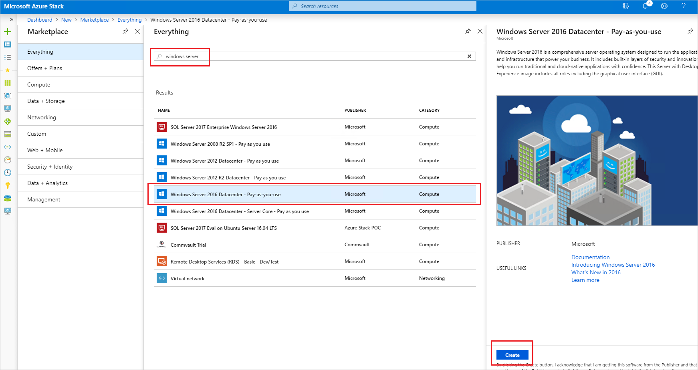
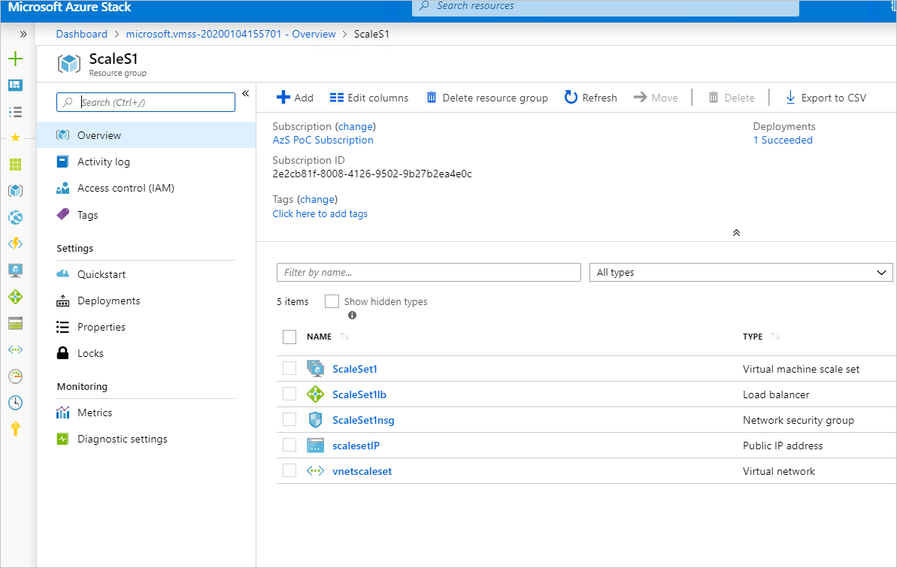

#  Lab Guide User lab

Cloud Operator Training - Azure Stack Hub Lab
Lab Guide
Version 0.1

## Overview

This lab consists of step-by-step procedures relevant for an Azure Stack Hub Operator. The lab uses an ASDK that is meant to provide an environment in which an IT Administrators or Developers can evaluate Azure Stack Hub and develop modern apps using APIs and tooling consistent with Azure in a *non-production* environment. The assumption for this ASDK is that it is deployed as an Azure Active Directory Integrated environment, therefore all Azure Stack Hub users are hosted from Azure vs a separate on premises Active Directory Domain Services environment.

In this set of procedures, the lab user will perform functions as both the Azure Stack Hub Operator and an Azure Stack Hub User. 

## Lab Environment

There are several ways to deploy an ASDK - you can check the http://aka.ms/asdk to download and use the Microsoft recommended options, or you could try community based scripts that help create ASDKs that are hosted even in Azure (https://github.com/yagmurs/AzureStack-VM-PoC).

Regardless how you deploy it, this guide assumes that:
1. you have a running ASDK, that leverages AAD for identity
2. the ASDK is already registered and configured (for more info on configuring it, either use the guidance found at https://docs.microsoft.com/azure-stack/asdk/asdk-install - or use the community based set of scripts called "[Azure Stack POC Configurator](https://github.com/mattmcspirit/azurestack)" )
3. PowerShell for Azure Stack Hub
4. Latest Azure Stack Hub Tools
5. Sample Virtual Machine Images from the Azure Marketplace
6. AppService Resource Provider
7. SQL Resource Provider
8. you have already connected to the ASDK environment

The guide also assumes you have access to the AzureStack\AzureStackAdmin, the AzureStack\CloudAdmin, as well as the AAD user that has Owner rights on the Default Provider Subscription of your ASDK (in most cases, this should be the same AAD-user that you used when installing the ASDK). In the following exercises, this user is named "aadUserName" and has the respective "aadUserPassword". 

# Workshop overview

The next exercises focus on the User experience of Azure Stack Hub. They go through:
1. Create the vnet, subnet,and NSG
1. Create the first VM
1. Create the second VM
2. Troubleshooting and password reset
3. Monitor VM metric
4. Using QuickStart Templates
5. Self Service User Subscription
6. Creating a VMSS

## Creating resources

In the next steps we will:

-   Create a virtual network

-   Create a subnet on this virtual network

-   Create a Network Security Group (NSG)

-   Assign the NSG to the subnet

> [!Note] resources can be created in the same Resource Group (RG) or in multiple RGs, as long as they are created in the same Azure Stack subscriptions, you will be able to use them. To simplify things, you should create them in the same RG.

> [!Note] If you didn't use Matt's script to configure your ASDK, yo will need to create a Azure Stack Hub User subscription first - in the following labs this is called "AzS PoC Subscription" - https://docs.microsoft.com/azure-stack/operator/azure-stack-subscribe-plan-provision-vm. You will also need to download images in the Azure Stack Marketplace Management - https://docs.microsoft.com/azure-stack/operator/azure-stack-download-azure-marketplace-item. 

While logged on to the ASDK Virtual Machine, open the Azure Stack User Portal using the "aadUserName" and the "aadUserPassword".

### Create the vnet, subnet, and NSG

\[create the virtual network\]

1.  Open the **Azure Stack User Portal** and login using the **aadUserName** user

2.    Click on "**Create a resource**", type "**Virtual Network**" and click "**create**" for the "**Virtual Network**" resource
    
    
3.  Complete the required fields in the "**Create virtual network**" blade

    > [!Note]  since this ASDK is completely separated from a networking perspective, you can use any names and "Address space" values. You could create a single Resource Group (RG) for all your resources, or multiple RGs for each resource type.
    
    

    \[create the NSG\]

4.  On the **Azure Stack User Portal**, click on "**Create a resource**", type and select the "network security group", and click "**Create**"

    

5.  Complete the required fields in the "**Create a network security group**" blade and select the same Resource Group name used before

    

6.  Go back to the main **Azure Stack User-Portal** dashboard and click on the vnet created. Select **Subnets** and click on the "+**subnet**" button

    

7.  Provide a name for this subnet and select the previously created NSG

    Once you click OK, the NSG will apply for the entire subnet.

    

    \[create the public IP\]

8.  On the Azure Stack User Portal, click on "**Create a resource**", type and select the "**public IP**", click **Create**

    

9.  Complete the required fields in the "**Create public IP address**" page

## Create the first VM

Using the resources created above, we will now create a VM:

1.  Open the **Azure Stack User Portal** and login using the **aadUserName** user

2.  Click on "**Create a resource**", type "Windows Server", select the "**Windows Server 2016 Datacenter**" image and click **Create**

    

3.  Complete the required information in the blade and click OK when ready.

    > [!Note] as before, you could either use the same Resource Group (RG) for all the resources, or dedicated ones. For simplicity, you should use the same RG.

    

4.  Select the any size for the current Virtual Machine – for simplicity, please use **F2s\_v2 Standard** size.

    Click **Select** after you’ve selected the desired VM size.

    

5.  Select the previously created Virtual Network, subnet (do not use the default subnet, **select the subnet you have created previously**), and **Public IP**.

6.  For the Network Security Group, click on Advanced and select the "**Create new**" NSG (the previously created NSG was applied to the subnet, the one you will create now will be applied to this VM)

    > [!Note] when you will see a "(new)" in front of a certain resource (for example, in front of the NSG in the picture) that means you are creating a new resource as part of this process and not using an existing one.

7.  Review the Summary page and click "OK" to create the VM

    

8.  Once the deployment is initialized, you can click on it (click the notification bell on the top right corner and click on the deployment marked as in progress)

    > [!Note] in the deployment blade you can see each resource as it’s created in the respective order, as well as click on the "Operation details" for more information

    

9.  Connect to VM01 to test access

    > [!Note] you will see an error message that "Remote Desktop can’t connect to the remove compute" – this is because there are 2 NSGs applied to the VM and only one allows it

    

10.  Click on the Networking tab of the VM and check the two NSGs – notice how the NSG applied to the subnet does not have port 3389 open

11.  Click on "**Add inbound port rule**" and follow the wizard in the blade to Add port 3389 as an Inbound port

> [!Note] once added, connect to VM1 to test the connection

## Create the second VM

-   Create the **second** Windows Server VM:

    -   connect it to the same vnet/subnet, but do not assign this VM a Public IP

    -   use the same Resource Group to deploy it

    -   do not configure additional data disks

    -   use the same NSG as the one created for the first VM

-   From the Azure Stack User Portal, click on the Resource Group where you have deployed the VMs:

    -   Click on the the **second** VM to see its properties

    -   Click on Disks and add a new data disk:

        -   Use the same RG as before

        -   Create it as an empty disk and size it to 100GiB

-   Since this second VM does not have a PublicIP, to connect to it you will need to RDP into the first VM and from there RDP on the second VM using the PrivateIP of the VM.

    > [!Note] to identify the PrivateIP of the second VM, go to the "Network" tab of the VM

    

-   Once you connect to the second VM, first check the available disks (there should be a C: and a D: - where the D: is a temporary disk) and then initialize the DataDisk so it could be used:

    -   Right click on the Windows button and select "Disk Management"

    -   Initialize, create a new volume, and assign a letter so that the new store could be used

    -   Check the disk is available in the Windows Explorer

## Troubleshooting and password reset

Before beginning, verify that the "Azure Performance Diagnostics" Virtual Machine Extension is available in the Azure Stack Marketplace Management and create a Storage Account where the extension will upload the logs:

-   Go the to Administration portal of Azure Stack Hub

-   Click on the Azure Marketplace Management

-   If the "Azure Performance Diagnostics" Virtual Machine Extension is now already present, click on "Add from Azure"

-   Search for the "Azure Performance Diagnostics" Virtual Machine Extension and download it

-   Once downloaded it will be available for all users

-   To create a storage account for the logs, go to the Azure Stack User-Portal and click on the "Storage accounts" resource type

    -   Create a new storage account and place it in the same Resource Group (RG)

    -   Once created click on the new Storage Account and click on the "Access Keys"

        -   Note the "Storage account name" and any of the keys

        -   These will be used by the "Azure Performance Diagnostics" Virtual Machine Extension

1.  Open the **Azure Stack User Portal** and login using the **aadUserName** user

2.  Click on the either of the two VMs, select **Extensions**, and click **Add**

    

3.  Select the "**Azure Performance Diagnostics**" Virtual Machine Extension and review description

    

4.  Use the "**Storage account name**" and the "**Storage account key**" noted at the beginning of the exercise

    Select "**Slow VM analysis**" and a trace of 5min

    Note: make sure to use the FQDN of the storage account. Using just the storage account name, would default to an Azure name and the agent will not be able to upload to logs. To check on the agent progress, connect to the VM and go to "C:\\WindowsAzure\\Logs\\Plugins\\Microsoft.Azure.Performance.Diagnostics.AzurePerformanceDiagnostics" for the agent logs

    

5.  Once completed, there will be new container called "azdiagextnresults" in the given storage account

6.  Download the zip file, extract it and check the performance results

    

To reset the password of any of the Azure Stack VMs created, open the Azure Stack Portal and login using the aadUserName user:

-   Click on the either of the two VMs and select Reset Password

-   Specify the "username" and type the new password of the user you wish to set the password for

-   Once completed, you can connect to this VM with that respective user/password

## Monitor VM metric

1.  Open the Azure Stack Portal and login using the aadUserName user

2.  Click on the "Subscription" resources and the "AzS PoC Subscription" (used to create the previous resources)

3.  Click on "Resource Providers" and click Register for the Microsoft.Insights

4.  After a few minutes, metrics will appear in the "Overview" blade of each VM

> [!Note] if the ASDK doesn’t show the metrics right away, this isn’t a problem. On an Azure Stack Hub Integrated System this will show as in the example on the right

## Using QuickStart Templates

1.  Open the **Azure Stack User Portal** and login using the **aadUserName** user

2.  Click on "**Create a resource**" and select "**Template deployment**"

    

3.  Select "**Edit template**" and then click on "**QuickStart templates**"

    

4.  Select the "**101-vm-windows-create**" template

    > [!Note] examine the template imported and the structure of the JSON file. Click on the Virtual Machine resource and notice the Publisher, Offer, and SKU fields for "storageProfile" (we will work with this in the operator workshop)

    For more information on each of these template, open a web browser and go to <https://github.com/Azure/AzureStack-QuickStart-Templates> - here you will find all the templates and information on what they contain

5.  When ready, select "**Save**"

    

6.  Add the required **Parameters** and select a new **Resource Group**

    > [!Note] mind the subscription you are deploying to.

    

7.  Click on the Notification and the newly created "**Deployment in progress**" to check on the state of your deployment

    

    

8.  To validate if a certain image (OS Image) is available on your Azure Stack, you ill need to go to the **Azure Stack Admin Portal** and click on "Region Management"

    

9.  Click on **Resource Providers** and select **Compute**

    

10.  Select VM images

> [!Note] in the "VM images" are listed all the images available, including information like Publisher, Offer, and SKU – which you’ve noticed in the ARM template used from the QuickStart Templates

## Self Service User Subscription

1.  Open the **Azure Stack User Portal** and login using the aadUserName user

2.  Click on **All Services** and **Subscriptions**

    

3.  Click on **Add** and give your subscription a name

4.  Select an offer

    > [!Note] here you will only be able to use Offers which are made public – we will talk more about these on the Admin part, when talking about capacity planning, quotas, plans, and offers.

    

5.  Once created, the portal will need to refresh

6.  The subscription will now appear under the AzS PoC Subscription

## Creating a VMSS

1.  Open the **Azure Stack User Portal** and login using the **aadUserName** user

2.  Click on **Create a resource** and select the **Virtual machine scale set**

3.  Complete the required field (leave the instance count to 2)

    > [!Note] for simplifying the exercise create a new RG and a new VNet
    
    > [!Tip] add them in the same vnet created above and check connectivity between all the VMs and the loadbalancer configured for the VMSS
    
    
    
    

1.  Once the deployment is complete, browse to the VMSS RG

    

1.  Notice the new objects created and how the VMSS itself is slightly different than the blade for the VM, but in the same time similar

    

1.  Scale-up the VMSS by changing the count of the VMs to 3

    

1.  On the RG level, click on the **Activity log** – notice the changes done on the VMSS

    > [!Note] check the JSON used to change this – if needed, this can be used directly to script the process

