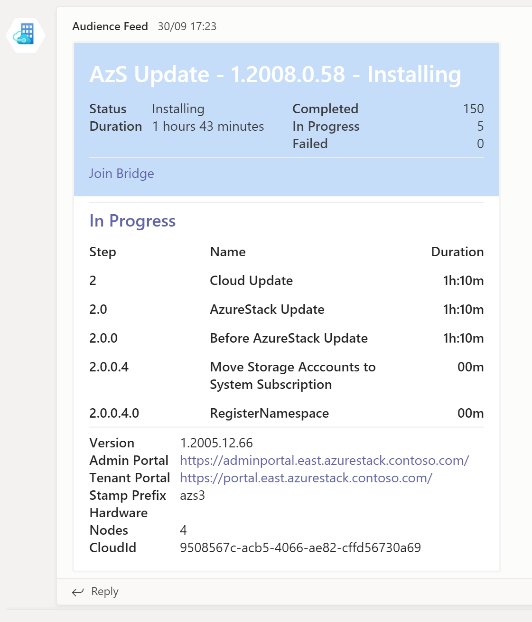
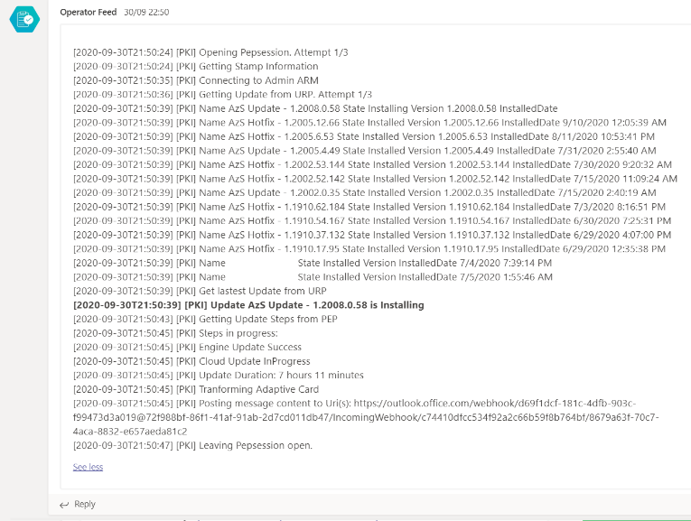
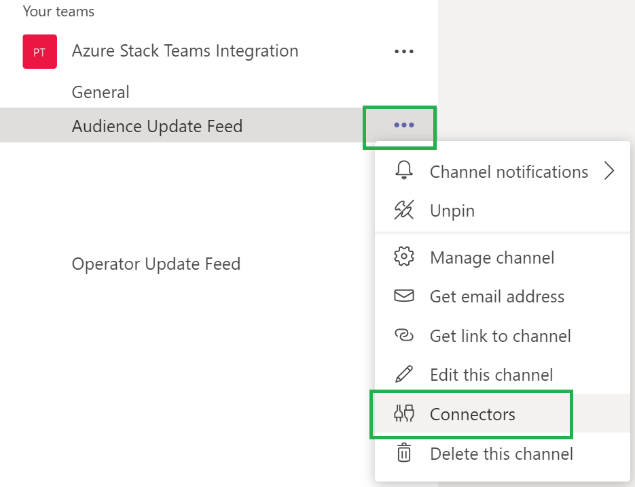
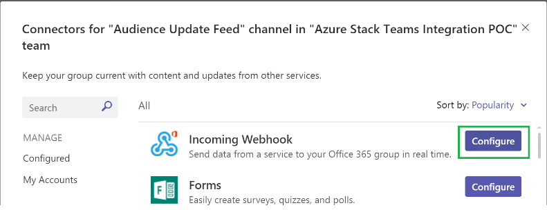
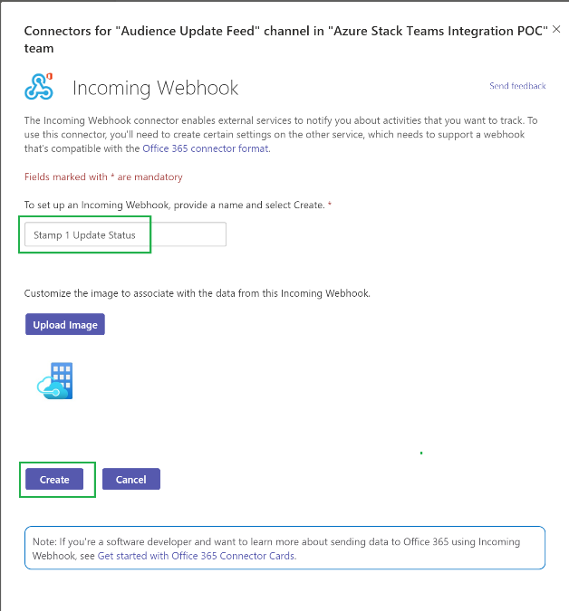
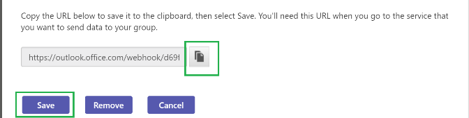

# Forwarding Azure Stack update status to Microsoft Team (Preview)

## Introduction

A tool has been created to assist in forwarding Azure Stack Update status to Microsoft Teams. The tool is a PowerShell function and uses a PEP connection and ARM calls to query the status of a running update and create an adaptive card and forwards to a Microsoft Teams channel via a webhook.

The tool has two personas audience and operator:



Audience Card -- Intended for Stakeholders



Operator Message -- Intended for Azure Stack Operators

## Prerequisites

-   Windows 10 or Windows 2019 OS with PowerShell 7
-   WINRM Connectivity to Privileged Endpoint (PEP)
-   HTTPS Connectivity to Azure Resource Manager (ARM)
-   HTTPS Connectivity to Office Webhook e.g. [https://outlook.office.com/webhook/\<etc](https://outlook.office.com/webhook/%3cetc)\>

## How to install

### Creating Webhook in Teams

Ref: [https://docs.microsoft.com/microsoftteams/platform/webhooks-and-connectors/how-to/add-incoming-webhook\#add-an-incoming-webhook-to-a-teams-channel](https://docs.microsoft.com/microsoftteams/platform/webhooks-and-connectors/how-to/add-incoming-webhook#add-an-incoming-webhook-to-a-teams-channel)

The tool can forward to multiple webhooks for both persona's, in this example there is an Audience channel and an Operator channel that happen to be in the same Team. Here is an example of creating the Audience connector.

Click the ellipse (**…**) on the target channel and click **Connectors**.



On **Connectors for '\<ChannelName\>' channel in '\<TeamName\>' team** page, find **Incoming Webhook** in the list of connectors and click **Configure**.



On **Connectors for '\<ChannelName\>' channel in '\<TeamName\>' team** page configure the webhook by giving it a **Name** this will be the name it posts as in Teams, optionally upload a profile image and click **Create**.



**Copy** the URI returned by the wizard to make a note of it for use later and hit **save** to close this screen.



Repeat that process for each channel that will receive update status.

### Configure PowerShell Environment

#### Install PowerShell 7

Open PowerShell as admin and run the following:

```powershell  
iex "& { $(irm https://aka.ms/install-powershell.ps1) } -UseMSI"
```

A dialog box will appear, finish the installation using all defaults.

#### Install Az/AzureStack modules

Open PowerShell 7 and run the following:

```powershell
Install-Module PowerShellGet -force;
Import-Module PowerShellGet -force;
Set-PSRepository -Name PSGallery -InstallationPolicy Trusted;
Install-Module -Name Az.BootStrapper -Force -AllowPrerelease;
Install-AzProfile -Profile 2019-03-01-hybrid -Force;
Install-Module -Name AzureStack -RequiredVersion 2.0.2-preview -AllowPrerelease;
Get-Module Azs.Management -ListAvailable | Uninstall-Module -Force 
Install-Module -Name Azs.Operator -RequiredVersion 0.1.2-preview -AllowPrerelease -Force -AllowClobber;
Install-Module -Name Azs.TeamsIntegration -AllowPrerelease -Force;
```

If you receive an error stating -AllowPrerelease is not a parameter, ensure PowerShell is updated and restart PowerShell 7.

#### Configure stamp for Azs.Operator

>   *Note:* Azs.Operator has replaced Azs.Management, if you have previously tested with Azs.Management, the stamp definition will be migrated automatically. If this is the case, you can skip forward to [Test Azs.TeamsIntegration](#_Test_Azs.TeamsIntegration).

In PowerShell 7, change the stamp name and the values for the stamp and run the following:

```powershell
$stampName = 'NWT'
Add-AzsStamp -Name $stampName `
                -Region "east" `
                -FQDN "azurestack.contoso.com" `
                -ErcsVM @("192.58.46.225", "192.58.46.224", "192.58.46.226") `
                -AdminUserName "serviceadmin@contoso.onmicrosoft.com" `
                -AdminUserTenantid 'e8321e1b-xxxx-xxxx-xxxx-xxxx' `
                -CloudAdminUserName "azs\cloudadmin"
```

##### Test Azs.TeamsIntegration

To send test messages, retrieve the webhook URIs created earlier and update appropriately below.

In PowerShell 7, run the following:

```powershell
$stampName = 'NWT'
$OperatorUri = "https://outlook.office.com/webhook/<etc>"
$AudienceUri = "https://outlook.office.com/webhook/<etc>"
$Bridge = "https://teams.microsoft.com/myteamsbridge" #optional if you have a call you like people to know about.
$PepCredential = Get-Credential -Message 'Cloud Administrator'
Send-AzsUpdate -AudienceUri $AudienceUri -OperatorUri $OperatorUri -Stamp $stampName -BridgeInformation $Bridge -PepCredential $PepCredential

```

> [!NOTE]
> `OperationUri` and `AudienceUri` can accept arrays if multiple channels are to be updated.

For the purpose of insider testing we would appreciate forwarding status to us also, please ask your PM or ask on the Insiders channel for your own webhook to report status to for MSFT only consumption. The additional webhook can be added to both operator and audience variables with the following syntax:  
\$OperatorUri = "https://outlook.office.com/webhook/\<Contoso_webHook\>","https://outlook.office.com/webhook/\<MSFT_Provided\>"

#### To continuously monitor an update and forward status to Teams

To start monitoring continuously:

\$OperatorUri = "https://outlook.office.com/webhook/\<etc\>"

\$AudienceUri = "https://outlook.office.com/webhook/\<etc\>"

\$Bridge = https://teams.microsoft.com/l/meetup-join/\<etc\>

\$PepCredential = Get-Credential -Message 'Cloud Administrator'

Watch-AzsUpdate -AudienceUri \$AudienceUri -OperatorUri \$OperatorUri -Stamp \$stampName -BridgeInformation \$Bridge -PepCredential \$PepCredential

This will send Audiences an update every 30 minutes and operators every 15, the values can be changed by using AudienceFrequency (30 or 60) and OperatorFrequency (5, 10 or 15).

##### Optional parameters

**-Brief** switch. Audiences and operators are only updated if there is a change to the update or the stamps update history. This is to minimise spam, it is turn off by default.

**-HideEnvironmentInformation** switch. This will remove the stamp inventory from the footer of the card.

**-DisposePep** switch. This will close the Pep session after each interval rather than keep it open. It will add a little bit more execution time, but may be useful if other tools are connecting to the Pep as well.

There are two choices to avoid credential prompts for the PEP whilst watching the update:

1) Store PEP Credential in Keyvault (set during Add-Stamp or Set-Stamp in Azs.Management module)

2) Pass -PepCredential parameter value (less secure)

#### How to report a problem

Please reach out on Teams Insiders or with your PM if you have an issue/feedback with the Teams Forwarding. To help us diagnose any problems quickly, provide the logs under:

`explorer "\$home\\.AzsMgmtTeams"`

Forward the zip with the first timestamp after the occurrence of the issue and include a screengrab of the issue in your teams channel.

#### Common Issues

**Symtom**: Access Denied from the PEPConnection.

**Reason**: The cloud administrator accounts will lock out after a number of failed attempts.

**Workaround**: Stop using the account for 30 minutes (this will reactivate it) and reset the credential. You can check the credential by inspecting the following properties for errors:

```powershell
$PepCredential.Username
$PepCredential.GetNetworkCredential().Password 
```

**Symtom**: Cannot connect to Azure Resource Manager.

**Reason:** Token cache is wrong

**Workaround:** Clear stamp cache and re-test:

```powershell
Clear-AzsStampCache
Connect-AzsArmEndpoint -stamp $stampName #satisfy the authentication prompt
Get-AzsUpdate
```

If the above is success you should see a list of updates applying or applicable to the stamp. The Watch-AzsUpdate command can be restarted.

Thank you for helping us test this is tool.
